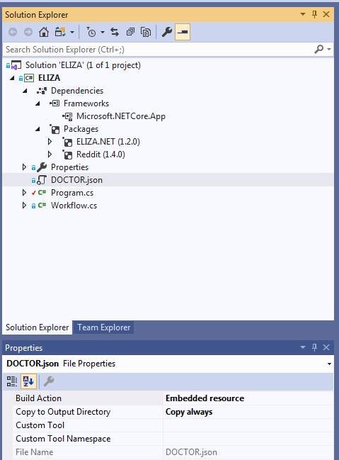

# Tutorial: ELIZA Chatbot

## Author

[Kris Craig](../../../docs/contributors/Kris%20Craig.md)

## Required libraries

[Reddit.NET](https://github.com/sirkris/Reddit.NET)

[ELIZA.NET](https://github.com/sirkris/ELIZA.NET)

| Table of Contents                                                               |
|:--------------------------------------------------------------------------------|
| [Overview](#overview)                                                           |
| [Live Demo](#live-demo)                                                         |
| [Library Installation](#library-installation)                                   |
| [Create the Project](#create-the-project)                                       |
| [The Workflow Class](#the-workflow-class)                                       |
| [Load the DOCTOR](#load-the-doctor)                                             |
| [Initialize the Libraries](#initialize-the-libraries)                           |
| [Main Loop](#main-loop)                                                         |
| [Event Handling](#event-handling)                                               |
| [Understanding MessagesUpdateEventArgs](#understanding-messagesupdateeventargs) |
| [Interacting With ELIZA](#interacting-with-eliza)                               |
| [Send the Response](#send-the-response)                                         |
| [Callback Function](#callback-function)                                         |
| [The Finished Solution](#the-finished-solution)                                 |

## Overview

This is a simple chatbot that monitors a designated Reddit bot account's new messages and sends replies.  The responses are generated using a recreation of an [early AI algorithm](https://en.wikipedia.org/wiki/ELIZA) written in 1966.  As such, don't expect it to be anywhere near as accurate or human-like as more modern AI chatbots.  

ELIZA is basically just an elaborate pattern-matching toy, so inputs should be limited to a single short sentence each for best results.  All punctuation is ignored.

This tutorial will focus on effective use of PrivateMessages.MonitorUnread, which monitors the active user's Reddit inbox for unread messages.

## Live Demo

If you'd like to see what this looks like in action, try sending a private message to [u/ElizaRobot](/u/ElizaRobot).  

You'll probably get faster results if you create your own, though, as I'm not currently running this 24/7.  When she is running, she checks for new messages every 15 seconds and responds immediately.

## Library Installation

In the NuGet Package Manager console:

    Install-Package ELIZA.NET
    
    Install-Package Reddit

## Create the Project

Open Visual Studio and create a new .NET Core Console Application.  Let's call the project "ELIZA".

### Handle Command-Line Arguments

When running the console application, the user will need to provide 2 arguments:  An AppID and a Refresh Token.  Assuming you've already [created the app on Reddit](https://www.reddit.com/prefs/apps/) and [obtained a Refresh Token](https://github.com/sirkris/Reddit.NET/blob/master/docs/examples/cs/Authorize%20New%20User.md), that shouldn't be a problem for you.  This will determine which Reddit user will be listening for and responding to ELIZA's messages.

### Program.cs

So let's start building our Program.cs file.  This is very straightforward, as all we'll be doing is parsing the command-line arguments and calling the workflow.  Here's how it should look:

```c#
using System;

namespace ELIZA
{
    class Program
    {
        // Load ELIZA script file and instantiate our libraries.  --Kris
        public static void Main(string[] args)
        {
            if (args.Length < 2)
            {
                Console.WriteLine("Usage: ELIZA <Reddit App ID> <Reddit Refresh Token> [Reddit Access Token]");
            }
            else
            {
                Workflow workflow = new Workflow(args);
                workflow.Run();
            }
        }
    }
}
```

## The Workflow Class

This will be where all the action takes place.  First, we'll need to add the necessary using statements:

```c#
using ELIZA.NET;
using Reddit;
using Reddit.Controllers.EventArgs;
using Reddit.Things;
using System;
using System.Collections.Generic;
using System.IO;
using System.Reflection;
```

Now let's build the wireframe:

```c#
namespace ELIZA
{
    public class Workflow
    {
        private ELIZALib Eliza;
        private RedditClient Reddit;
        public Dictionary<string, DateTime> ActiveSessions;

        public bool Stop;

        public Workflow(string[] args)
        {
            
        }
    }
}
```

The Eliza and Reddit properties are self-explanatory.  Stop is a boolean that's always false, but if you set it to true during an event it'll end the main program loop.  

ActiveSessions is how we keep track of session data; each one represents a conversation and is bound to a given private message thread.  This enables ELIZA to safely engage in multiple conversations with different people at the same time.

## Load the DOCTOR

ELIZA works by loading a script file that contains all the different triggers and responses.  The only one I'm aware of is the original, called DOCTOR.  This is what we'll be using.

You can find [DOCTOR.json](https://raw.githubusercontent.com/sirkris/ELIZA.NET/master/scripts/DOCTOR/DOCTOR.json) in the [ELIZA.NET](https://github.com/sirkris/ELIZA.NET) repo.  Once you have it, add it to your project as an existing item in Visual Studio and make it an Embedded Resource set to Copy Always.



Now we're ready to load the DOCTOR.json resource, which will then be passed to our ELIZA instance as a string.  So let's start our Workflow constructor with this:

```c#
string json = null;
using (Stream stream = Assembly.GetExecutingAssembly().GetManifestResourceStream("ELIZA.DOCTOR.json"))
{
    using (StreamReader streamReader = new StreamReader(stream))
    {
        json = streamReader.ReadToEnd();
    }
}
```

## Initialize the Libraries

Now that the DOCTOR is in, it's time to instantiate our Reddit and ELIZA libraries:

```c#
Eliza = new ELIZALib(json);
Reddit = new RedditClient(appId: appId, refreshToken: refreshToken, accessToken: accessToken);
ActiveSessions = new Dictionary<string, DateTime>();
```

That's it for the constructor.

## Main Loop

In the Workflow class, create a new void method called Run with no arguments.  Let's take a look at the code, then I'll walk you through it:

```c#
public void Run()
{
    Stop = false;

    Reddit.Account.Messages.MonitorUnread(15000);
    Reddit.Account.Messages.UnreadUpdated += C_UnreadMessagesUpdated;

    while (!Stop) { }

    Reddit.Account.Messages.UnreadUpdated -= C_UnreadMessagesUpdated;
    Reddit.Account.Messages.MonitorUnread();
}
```

The call to MonitorUnread tells Reddit.NET to create a new monitoring thread, which will automatically query the Reddit API for new messages every 15 seconds and fire an event if any new unread messages are detected.  The line below that subscribes the callback function we'll be creating to said event.

Since everything pretty much happens in the callback function, there's really nothing for the main thread to do but sit on its ass and wait until somebody tells it to stop.  You can of course add your own code here to suit your particular needs.

After that, we unsubscribe the callback function from the event.  The second call to MonitorUnread tells Reddit.NET to terminate the monitoring thread.

## Event Handling

The callback function is what fires whenever Reddit.NET detects a new unread message.  We will be passing that message along to the ELIZA.NET library, which will generate a response that we will then send back as a message reply on Reddit.

### Understanding MessagesUpdateEventArgs

Let's start by declaring the method:

```c#
private void C_UnreadMessagesUpdated(object sender, MessagesUpdateEventArgs e)
```

MessagesUpdateEventArgs is what's passed back by Reddit.NET via the event and it contains a list of all newly-detected messages received by the active user, found in the NewMessages property.  Each Message entry contains all the metadata for the message.  In this case, we'll only be using the Subject, Body, and Author properties.

The first line of our callback function will be an if statement encompassing the remainder of the method:

```c#
if (e.NewMessages.Count > 0)
```

This is necessary because the monitoring event can also fire if messages are *removed* from the unread inbox, so we'll want to just ignore it when that happens.

We'll also want to mark all the messages as read so they won't keep firing (in 1.5 and later, you could also just rely on the caching to filter those out):

```c#
Reddit.Account.Messages.MarkAllRead();
```

Now it's time to iterate through the new unread messages:

```c#
foreach (Message message in e.NewMessages)
```

### Interacting With ELIZA

Before we interact with the ELIZALib, we first need to manage our sessions and see whether this is an existing conversation or not.  This is used to determine whether or not she should send the greeting as her response.

So let's handle the greeting part, first:

```c#
string response;
if (!ActiveSessions.ContainsKey(message.Author))
{
    ActiveSessions.Add(message.Author, DateTime.Now);
    response = Eliza.Session.GetGreeting();
}
```

Here, we're checking to see if ELIZA is already talking to this Reddit user and sending a greeting if she's not.  If you'd rather use your own greeting, just set response to that instead of GetGreeting.

With the greeting check out of the way, we can now put together our response:

```c#
else
{
    if (message.Body.Contains("bye", StringComparison.OrdinalIgnoreCase)
        || message.Body.Contains("farewell", StringComparison.OrdinalIgnoreCase)
        || message.Body.Equals("exit", StringComparison.OrdinalIgnoreCase)
        || message.Body.Equals("quit", StringComparison.OrdinalIgnoreCase))
    {
        ActiveSessions.Remove(message.Author);
    }

    response = Eliza.GetResponse(message.Body);
}
```

First, we check to see if the user wants to end the session.  This can be done by sending a message that contains the word "bye", "farewell", "exit", or "quit".

Getting the actual response from ELIZA is incredibly easy.  Just pass the message body to ELIZALib.GetResponse and it will return a string representing ELIZA's response.

### Send the Response

Now that we have our response string, all we have to do is send it as a message reply and we're done:

```c#
Reddit.Account.Messages.Compose(message.Author, message.Subject, response);
```

### Callback Function

This is what your final callback function should look like:

```c#
private void C_UnreadMessagesUpdated(object sender, MessagesUpdateEventArgs e)
{
    if (e.NewMessages.Count > 0)
    {
        Reddit.Account.Messages.MarkAllRead();

        foreach (Message message in e.NewMessages)
        {
            string response;
            if (!ActiveSessions.ContainsKey(message.Author))
            {
                ActiveSessions.Add(message.Author, DateTime.Now);
                response = Eliza.Session.GetGreeting();
            }
            else
            {
                if (message.Body.Contains("bye", StringComparison.OrdinalIgnoreCase)
                    || message.Body.Contains("farewell", StringComparison.OrdinalIgnoreCase)
                    || message.Body.Equals("exit", StringComparison.OrdinalIgnoreCase)
                    || message.Body.Equals("quit", StringComparison.OrdinalIgnoreCase))
                {
                    ActiveSessions.Remove(message.Author);
                }

                response = Eliza.GetResponse(message.Body);
            }

            Reddit.Account.Messages.Compose(message.Author, message.Subject, response);
        }
    }
}
```

## The Finished Solution

The complete source code can be found here:  **https://github.com/Reddit-NET/ELIZA**
